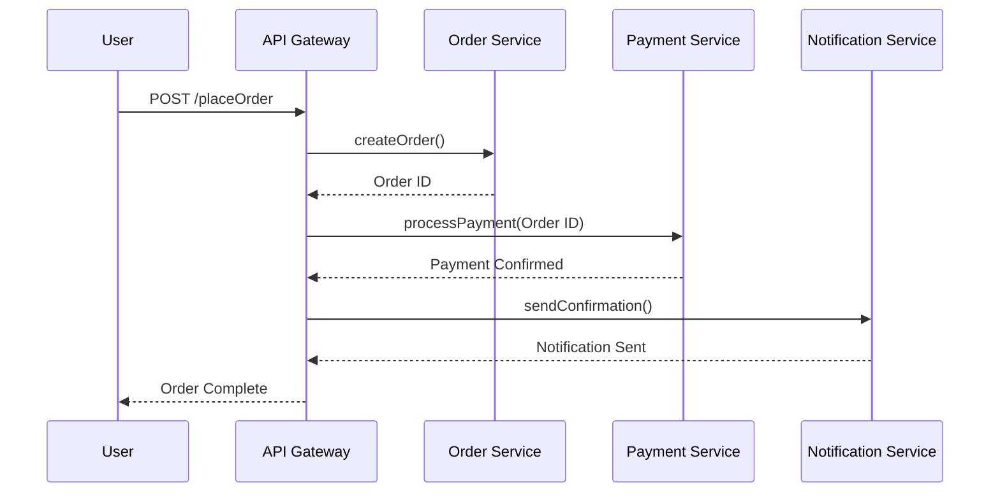

# 15.0 Request-Based 모델

Request-Based 모델은 시스템 간의 통신이 **요청(Request)** 과 **응답(Response)** 에 기반하여 동작하는 소프트웨어 아키텍처 스타일
주로 HTTP, RPC, gRPC 등의 프로토콜을 사용하며, **마이크로서비스 아키텍처**에서 널리 활용

## 15.1 예시

사용자가 프론트엔드 애플리케이션에서 '회원가입' 버튼을 누르면, 백엔드 API 서버에 `POST /signup` 요청을 보내고, 서버는 이를 처리한 후 응답을 반환하는 구조

```
Client --> API Gateway --> Auth Service --> User Service --> DB
                   <--        <--           <--
```


## 15.1 데이터 토폴로지

| 토폴로지 유형 | 설명 |
|--------------|------|
| **Monolithic** | 모든 기능이 하나의 애플리케이션에 포함되어 있고, 내부에서 요청/응답을 처리함. |
| **Domain** | 각 도메인(예: 사용자, 주문, 결제 등)이 독립된 서비스로 분리되어 각각 요청을 처리함. |
| **Dedicated** | 특정 요청을 처리하기 위한 전용 채널 또는 마이크로서비스가 존재함. |


## 15.2 스타일 특성

| 항목 | 설명 |
|------|------|
| **1. Derived Events** | 요청 처리 중 발생하는 부가적인 이벤트 (예: 회원가입 후 환영 이메일 전송). |
| **2. Triggering Extensible Events** | 다른 시스템이 구독할 수 있는 확장 가능한 이벤트를 유발함. |
| **3. Asynchronous Capabilities** | 요청은 즉시 응답을 받되, 백엔드에서는 비동기 작업을 병행 가능. |
| **4. Broadcast Capabilities** | 하나의 요청 결과로 여러 서비스에 이벤트를 전파할 수 있음. |
| **5. Event Payload** | 이벤트 데이터 구조 <br> - **Data-based**: 전체 데이터를 포함 <br> - **Key-based**: 참조 키만 포함 <br> - **Anemic Events**: 필수 정보만 포함하는 간단 이벤트 |
| **6. Swarm of Gnats Antipattern** | 과도하게 세분화된 요청이 많아지면 오히려 성능 저하 및 추적 어려움 발생. |
| **7. Error Handling – Workflow Event Pattern** | 요청 실패 시 이벤트 흐름을 기반으로 오류 처리 경로를 분기함. |
| **8. Preventing Data Loss** | 큐 사용이나 DB에 기록하여 요청 중 발생할 수 있는 데이터 유실 방지. |
| **9. Request-Reply Processing** | 요청에 대한 명확한 응답이 필요하며, 그 응답을 기반으로 후속 작업 수행. |
| **10. Mediated Event-Driven Architecture** | 직접 호출 대신 중재자(Mediator)를 통해 이벤트 중심 구조 구성. |


## 15.3 종합 평가

| 항목 | 평가 |
|------|------|
| **확장성** | 높음 – 마이크로서비스의 수평 확장 용이 |
| **응집도** | 낮을 수 있음 – 서비스 간 요청 의존도 증가 |
| **장애 격리** | 좋음 – 개별 서비스 장애가 전체 시스템에 영향 없음 |
| **복잡도** | 높음 – 호출 체인 및 에러 핸들링이 복잡해질 수 있음 |
| **데이터 일관성** | ⚠ 약함 – 분산 트랜잭션 및 eventual consistency 고려 필요 |


## 15.4 활용 예시

### 전자상거래 플랫폼

사용자가 주문을 요청하면,  
→ 주문 서비스 → 결제 서비스 → 배송 서비스 등 요청 기반으로 처리됨.

### 모바일 뱅킹 시스템

사용자 인증 → 계좌 이체 → 알림 전송 등이 모두 개별 요청-응답 방식으로 분리되어 처리됨.  
비동기 이벤트는 알림 전송, 로그 기록 등에 활용.


## 요청 흐름 예시 다이어그램




> ✅ Request-Based 모델은 명확한 API 경계 설정과 흐름 제어가 필요한 시스템에 적합하며, 이벤트 기반 아키텍처와 혼합하여 더욱 유연하게 구성할 수 있음
